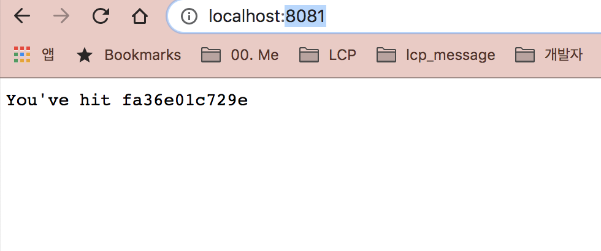

## 도커와 쿠버네티스 첫걸음
### 2.1 컨테이너 이미지의 생성, 실행, 공유

### 2.1.1 도커 설치와 Hello World 컨테이너 실행

도커설치
- https://docs.docker.com/docker-for-mac/install/
- docker run busybox echo "Hello Bestselect"

```
user@AL01394116  ~/kube  docker run busybox echo "Hello Bestselect"
Unable to find image 'busybox:latest' locally
latest: Pulling from library/busybox
9758c28807f2: Pull complete
Digest: sha256:a9286defaba7b3a519d585ba0e37d0b2cbee74ebfe590960b0b1d6a5e97d1e1d
Status: Downloaded newer image for busybox:latest
Hello Bestselect
```

이미지 실행
- docker run <image>

컨테이너 이미지 버전
- docker run <image>:<tag>


### 2.1.2 간단한 Node.js 앱만들기

- app.js 참고

### 2.1.3 이미지용 도커 파일 만들기

docker build -f kubia -t kubia  .

```
[+] Building 0.0s (7/7) FINISHED
 => [internal] load build definition from kubia                                                                  0.0s
 => => transferring dockerfile: 31B                                                                              0.0s
 => [internal] load .dockerignore                                                                                0.0s
 => => transferring context: 2B                                                                                  0.0s
 => [internal] load metadata for docker.io/library/node:7                                                        0.0s
 => [internal] load build context                                                                                0.0s
 => => transferring context: 28B                                                                                 0.0s
 => [1/2] FROM docker.io/library/node:7                                                                          0.0s
 => CACHED [2/2] ADD app.js /app.js                                                                              0.0s
 => exporting to image                                                                                           0.0s
 => => exporting layers                                                                                          0.0s
 => => writing image sha256:c3d6051f46daaaaaad922de930b22a70484412daa4a4036e944d075694e102b4                     0.0s
 => => naming to docker.io/library/kubia
```
### 2.1.5 컨테이너 이미지 실행

kubia-container 를 백그라운드에서 실행, 로컬포트 8081이 컨테이너 포트 8080으로 맵핑된다.
docker run --name kubia-container -p  8081:8080 -d kubia

```
dfb5ef2b369eeeda540fbeae8d49209aa802c2f7bc06ace24b92d2bc07a5e141
```
result



### 2.1.7 컨테이너 중지 및 제거 
docker stop kubia-container

```
kubia-container
```

docker rm kubia-container

```
kubia-container
```

### 2.2 쿠버네티스 클러스터 설정

### 2.2.1 미니큐브를 사용한 로컬의 단일 노드 쿠버네티스 클러스터 실행

brew install minikube

minikube start

#### 쿠버네티스 클라이언트 설치
curl -LO "https://storage.googleapis.com/kubernetes-release/release/$(curl -s https://storage.googleapis.com/kubernetes-release/release/stable.txt)/bin/darwin/amd64/kubectl"

chmod +x ./kubectl

sudo mv ./kubectl /usr/local/bin/kubectl

kubectl version --client

#### 클러스터가 작동하는지 확인하고 kebectl로 명령하기

kubectl cluster-info

```
Kubernetes master is running at https://127.0.0.1:32768
KubeDNS is running at https://127.0.0.1:32768/api/v1/namespaces/kube-system/services/kube-dns:dns/proxy
```

### 2.2.2 구글 쿠버네티스 엔진에서 호스팅된 쿠버네티스 클러스터의 사용

#### 구글 클라우드 프로젝트의 셋업 및 필수 클라이언트 바이너리 다운로드

curl https://sdk.cloud.google.com | bash

exec -l $SHELL

gcloud init

- 문서 : https://cloud.google.com/sdk/docs/downloads-interactive?authuser=1

#### 세 개의 노드를 가진 쿠버네티스 클러스터 생성

gcloud container clusters create  kubia --num-nodes 3

```
Creating cluster kubia in asia-northeast3-a... Cluster is being health-checked (master is healthy)...done.
Created [https://container.googleapis.com/v1/projects/boardgame-scout/zones/asia-northeast3-a/clusters/kubia].
To inspect the contents of your cluster, go to: https://console.cloud.google.com/kubernetes/workload_/gcloud/asia-northeast3-a/kubia?project=boardgame-scout
kubeconfig entry generated for kubia.
NAME   LOCATION           MASTER_VERSION   MASTER_IP      MACHINE_TYPE   NODE_VERSION     NUM_NODES  STATUS
kubia  asia-northeast3-a  1.16.13-gke.401  34.64.104.122  n1-standard-1  1.16.13-gke.401  3          RUNNING
```

#### 클러스터 개념 이해

- 각 노드는 도커, Kubelet, kube-proxy를 실행한다. 
- 마스터 노드에서 실행 중인 쿠버네티스 API서버에 REST 요청을 보내는 Kubectl 명령행 클라이언트를 통해 클러스터와 상호 작용한다.

#### 클러스 노드 목록으로 클러스터가 잘 작동하는지 확인하기


#### 객체의 세부 사항 가져오기 


### 2.2.3 alias와 kubectl 명령행 셋업하기

#### 별칭 만들기

### 2.3 쿠버네티스에서 첫 번째 앱 실행

### 2.3.1 Node.js 앱 배포

#### 포드 소개

- 포드는 하나 이상의 밀접하게 관련된 컨테이너로 구성된 그룹을 의미한다.

#### 포드 나열하기

#### 화면 뒤에 숨겨진 내용 이해 
그림 2.6


### 2.3.2 웹 애플리케이션 액세스
- 서비스 객체를 통해 IP를 노출해야한다.
- 포드와 같은 일반 서비스(ClusterIP) 를 만들면 클러스터 내부에서만 액세스 할수 있기 때문에
- LB 형태의 특별한 서비스를 만들것이다.

kubuctl expose rc kubia --type=LoadBalancer --name kubia-http

#### 서비스 나열

kubectl get services

kubectl get scv

- 쿠버네티스가 실행중인 클라우드 인프라스트럭처에서 로그 밸런서를 생성이 완료되면 외부 IP주소가 표시된다.

#### 외부 IP를 통한 서비스 액세스

- curl IP:8080


### 2.3.3 시스템의 논리적 부분

#### 레플리케이션 컨트롤러, 포드, 서비스가 동작하는 방식의 이해

그림 2.7 시스템은 레플리케이션 컨트롤러, 포드, 서비스로 구성된다.

#### 포드와 컨테이너의 이해
- 원하는 만큼 컨테이너를 포함시킬수 있다.
- 고유한 개인 IP 주소화 호스트 이름을 갖는다.

#### 레플리케이션 컨트롤러의 역할

- 항상 포드 인스턴스를 정확히 하나만, 실행한다.
- 여기서세 복제복 수를 지정하지 않았으면 단일 복제본을 생성한다.
- 어떤 이유로든 포드가 사라지면 레플리케이션 컨트롤러는 누락된 포드를 대체한 새로운 포드를 만든다.

#### 서비스가 필요한 이유

- 포드는 일시적이다. 이중 하나가 제거되면 앞에서 설명한 대로 레플리케이션 컨트롤러가 손실된 포드를 새로운 포드로 대체한다.
- 새로운 포드는 대체한 포드와 다른 IP 주소를 항당 받는다.
- 끊임없이 변화하는 포드 IP주소의 문제를 해결하고 단일 IP 및 포트 쌍에서 여러개의 포드를 노출시키는 서비스가 필요하다.

### 2.3.4 애플리케이션의 수평 스케일링

### 레플리카(복제본) 수 증가시키기

kubectl scale rc kubia --replicas=3

#### 스케일아웃 결과보기

kubectl get rc

#### 서비스 요청 시 세 개의 포드에 요청하는지 확인

curl ...

#### 시스템의 새로운 상태 시각화

그림 2.8

### 2.3.5 앱이 실행되는 노드 검사

?
- 동일한 노드에서 실행중인지 여부에 관계없이 포드끼리 통신할 수 있다.

#### 포드를 나열할 때 포드 IP와 포드의 노트 표시하기

kubectl get pods -o wide

### 2.3.6 쿠버네티스 대시보드 소개

#### 구글 쿠버네티스 엔진에서 쿠버네티스 실행할때 대시보드 액세스 하기

kubectl cluster-info | grep dashboard
(암호확인방법 P-106)

#### 미니큐브 사용 중에 대시보드 액세스 하기


### 2.4 요약


